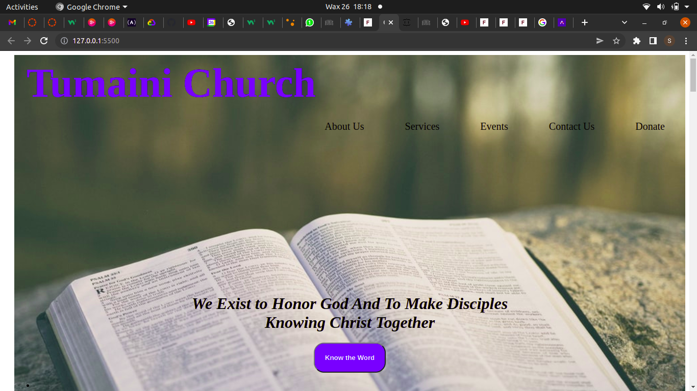
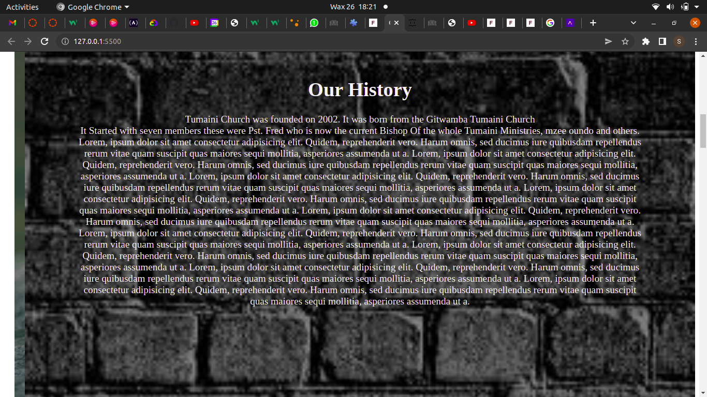
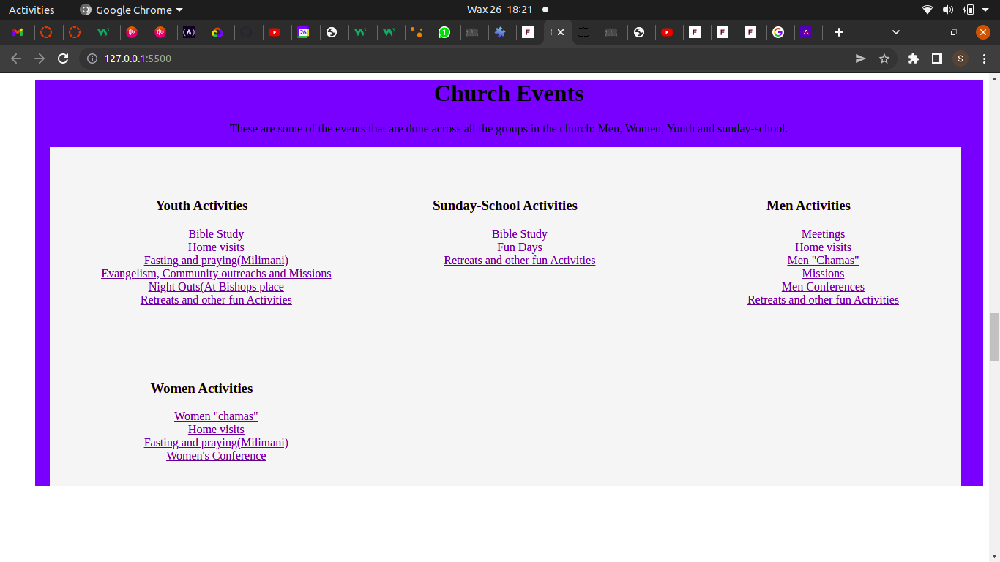
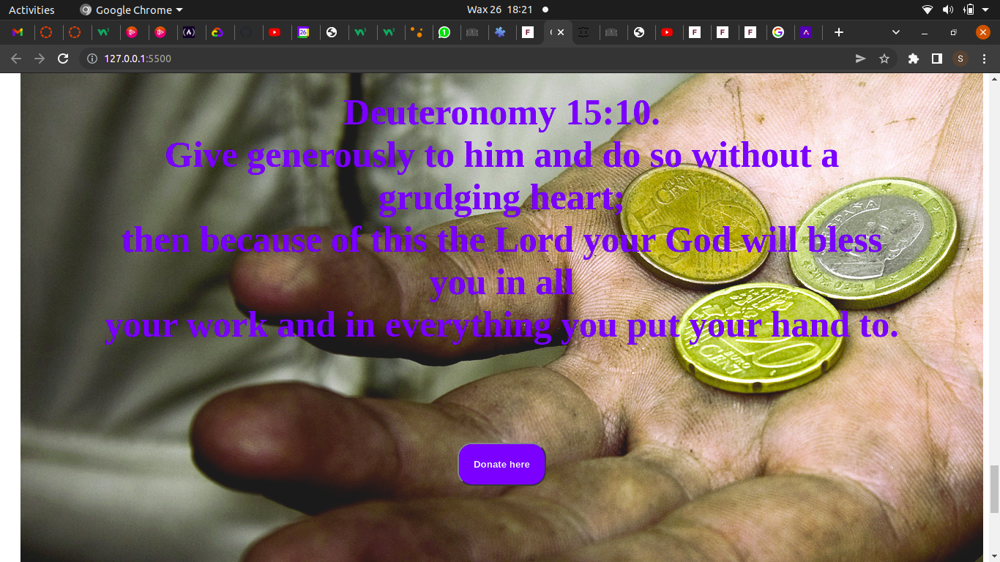

# OUR CHURCH

## by sylvia boyani

## Landing Page

## History of the Church

## Services of the Church

## More Info

 
 

## Table of Content

- [Description](#description)
- [Features](#features)
- [Behaviour Driven Development](#Behaviour-Driven-Development)
- [Requirements](#requirements)
- [Installation Process](#installation-Process)
- [Live Link](#Live-Link)
- [figma Link] (#Figma-Link)
- [Technology  Used](#technology-Used)
- [Licence](#licence)
- [Authors Info](#Authors-Info) -

## Description

  
This project hosts and displays information and program about Tumaini Church. A user can also access the Bible through the search button read and understand various versions.

## Features
As a user of the application,you will be able to :
1. Find information on the church.
1. Access a free Bible for studies and other things
  

## Behaviour Driven Development|

Show information of the church and invite new members new members to know the word of God.
Search for any book of the bible one may want to read or meditate on.

### Requirements

- Access to  a computer or any other garget
- Access to internet

### Installation Process

- Clone to thir repo : git clone <https://github.com/sylvia-boyani/phase1-project.git>
- Unzip the downloaded files in a folder of choice.
- Open the index file from the zipped file with any browser.

### live link <https://sylvia-boyani.github.io/phase1-project/>

### API link <* https://dog.ceo/api/breeds/image/rand...>

### Technology used

- HTML - which was used to develope the structure off the pages.
- CSS - which was used to style the User Interface.
- JS - Used in validating data and accessing the API
- dog.ceo api for getting data from.

### License

 Copyright (c) [2022] [sylvia boyani]
Permission is hereby granted, free of charge, to any person obtaining a copy
of this software and associated documentation files (the "Software"), to deal
in the Software without restriction, including without limitation the rights
to use, copy, modify, merge, publish, distribute, sublicense, and/or sell
copies of the Software, and to permit persons to whom the Software is
furnished to do so, subject to the following conditions:
The above copyright notice and this permission notice shall be included in all
copies or substantial portions of the Software.
THE SOFTWARE IS PROVIDED "AS IS", WITHOUT WARRANTY OF ANY KIND, EXPRESS OR
IMPLIED, INCLUDING BUT NOT LIMITED TO THE WARRANTIES OF MERCHANTABILITY,
FITNESS FOR A PARTICULAR PURPOSE AND NONINFRINGEMENT. IN NO EVENT SHALL THE
AUTHORS OR COPYRIGHT HOLDERS BE LIABLE FOR ANY CLAIM, DAMAGES OR OTHER
LIABILITY, WHETHER IN AN ACTION OF CONTRACT, TORT OR OTHERWISE, ARISING FROM,
OUT OF OR IN CONNECTION WITH THE SOFTWARE OR THE USE OR OTHER DEALINGS IN THE
SOFTWARE.
[Go Back to the top](#signing system)

### Authors' info

Feel free to reach out via:

- LinkedIn Profile - [Sylvia Boyani](https://www.linkedin.com/in/sylvia-boyani)
- Instagram - [boyani_sylvia](https://boyani_sylvia.intagram/)